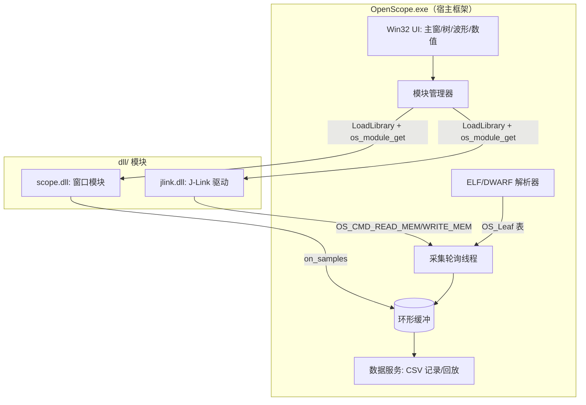

# Architecture Spine — OpenScope

## Design Paradigm

**插件化宿主 + 分层**：`OpenScope.exe` 是宿主，运行时从 `dll/` 加载模块（DLL），每个模块通过 C ABI 导出 `os_module_get()` 描述自身能力（驱动 `OS_CAP_DRIVER` / 窗口 `OS_CAP_WINDOW`）。宿主只依赖 `module_api.h` 契约；模块通过 `OS_Framework` 回调反向调用宿主能力。数据流：ELF 变量 → 扁平叶子 → 轮询线程按地址读内存 → 带时间戳的 `OS_Sample` → 环形缓冲 → 窗口/记录器。



## Invariants & Rules

### AD-1 — 模块 ABI 冻结

- **Binds:** FR5, FR6；`module_api.h`
- **Prevents:** 框架与模块二进制不兼容、字段错位
- **Rule:** `OS_Module`/`OS_Framework` 的字段顺序与类型不得修改，只能追加版本化字段；模块必须导出 `os_module_get`，API 版本必须等于 `OS_API_VERSION`。

### AD-2 — 驱动访问只走模块命令通道

- **Binds:** FR4, FR7；`module_mgr.c`
- **Prevents:** 宿主与具体仿真器（J-Link）耦合
- **Rule:** 宿主只能通过 `OS_Module::command` 与 `OS_CMD_SCAN/CONNECT/DISCONNECT/READ_MEM/WRITE_MEM/GET_INFO/...` 交互，禁止直接调用 JLink API。

### AD-3 — 变量扁平化为叶子

- **Binds:** FR2, FR3；`vartree.c`, `elf.c`
- **Prevents:** 采集路径重复解析 DWARF 类型树
- **Rule:** ELF 加载时把全局变量/结构体/联合体/数组展开为 `OS_Leaf` 标量叶子（含绝对地址、类型、位域、枚举）；采集/绘图只消费叶子。

### AD-4 — 采样必须带时间戳

- **Binds:** FR4, FR7；`datasrv.c`, `module_api.h`
- **Prevents:** 绘图/记录失去时间基准、无法后处理
- **Rule:** 所有读/写样本填充 `OS_Sample.ts_us`（Unix 微秒），统一经环形缓冲分发。

### AD-5 — ELF 热加载由宿主统一管理

- **Binds:** FR2；`mainwin.c`, `module_mgr.c`
- **Prevents:** 用户重编译后读取旧地址
- **Rule:** 宿主轮询已加载 ELF 的 mtime；变化时弹窗确认 → 重新解析并刷新全部叶子地址 → 广播 `OS_CMD_ELF_RELOADED`/`on_reload`；找不到的变量弹窗询问是否忽略。

### AD-6 — 依赖方向单向

- **Binds:** FR6；全部模块
- **Prevents:** 模块间直接耦合、循环依赖
- **Rule:** 依赖只能为：模块 → `OS_Framework` 回调，宿主 → `OS_Module` 导出；模块之间禁止互相调用。

### AD-7 — J-Link 运行时动态绑定

- **Binds:** FR7；`module/jlink`
- **Prevents:** 缺少 SEGGER SDK 头文件/导入库导致无法构建
- **Rule:** `jlink.dll` 用 `LoadLibrary` + `GetProcAddress` 绑定 `dll/JLink_x64.dll` 的导出（JLINK_Open/Connect/ReadMem/WriteMem/...），不链接导入库。

### AD-8 — 记录格式 v1 = CSV

- **Binds:** FR4；`datalog.c`
- **Prevents:** 数据通道设计阻塞采集主线
- **Rule:** v1 支持 CSV 记录与离线回放；MF4 等二进制格式延后到 Deferred。

### AD-9 — 构建环境归一

- **Binds:** NFR3；仓库根
- **Prevents:** PATH/Path 大小写重复导致 MSB6001、沙箱只读 .git 丢进度
- **Rule:** 用 `build.py` 规范化环境后调 `build.bat`；进度以 `checkpoint-N` git 提交保存（提交需提权）。

### AD-10 — 叶子 id 生命周期与重载互斥

- **Binds:** FR2, FR5；`vartree.c`, `module_mgr.c`
- **Prevents:** 模块缓存旧 id 指向错变量；重载与采集线程并发导致悬空访问
- **Rule:** 叶子 id 仅在单次 ELF 加载生命周期内有效；模块必须实现 `on_reload` 按名称重解析（找不到置 -1），框架不承诺 id 跨重载稳定。ELF 重载必须在采集暂停下进行，完成后再恢复轮询。

### AD-11 — 样本所有权与数据约定

- **Binds:** FR4, FR7；`datasrv.c`, `module_api.h`
- **Prevents:** 多消费者竞态、字节序/时钟分歧、读写交错
- **Rule:** 环形缓冲与 `OS_Sample` 为框架独占；模块只经 `on_samples` 只读消费。`raw` 一律为目标机字节序（框架按叶子类型解码）；`ts_us` 统一用 `os_time_us()`。驱动模块内部用互斥序列化 READ/WRITE。

## Consistency Conventions

| Concern | Convention |
| --- | --- |
| 命名 | 类型 `OS_*`、函数 `os_*`/`os_<模块>_*`、常量全大写下划线 |
| 数据/格式 | `OS_Leaf` 叶子表；`OS_Sample.ts_us` 微秒时间戳；CSV 记录；UTF-8 文本 |
| 状态/错误 | `volatile LONG` + `Interlocked*`；错误码 `OS_ERR_*`；日志 `OS_LOG_*` |
| 跨线程 | 环形缓冲受 `ring_cs` 保护；UI 更新经 `PostMessage(WM_OS_*)` |

## Stack

| Name | Version |
| --- | --- |
| C（C11, `/std:c11`） | MSVC v145（VS 18 Community, `C:\Program Files\Microsoft Visual Studio\18\Community`） |
| Win32 API + Common Controls | comctl32 v6（manifest 内嵌） |
| ELF/DWARF 解析 | 自研 `code/src/elf.c`（ELF32/64, ARM Cortex-M） |
| J-Link ARM DLL | `dll/JLink_x64.dll`（SEGGER JLink V966） |
| 构建 | MSBuild 18.8 / `build.bat` / `build.py` 包装 |
| 版本管理 | git 2.55（checkpoint 提交） |

## Structural Seed

```text
OpenScope/
  code/                # 宿主框架源码（main.c + src/*.c, *.h）
    src/               #   UI(mainwin/ui/chartwin/numwin)、ELF、数据、模块管理
  module/              # 模块源码（一个功能一个子目录）
    jlink/             #   J-Link 驱动模块 → dll/jlink.dll
    scope/             #   波形窗口模块 → dll/scope.dll
  dll/                 # 模块产物 + JLink_x64.dll（依赖库，非模块）
  bin/Release/         # OpenScope.exe 输出
  _bmad-output/        # BMAD 规划/实施产物
```

## Capability → Architecture Map

| Capability / Area | Lives in | Governed by |
| --- | --- | --- |
| FR1 UI 主界面 | `code/src/mainwin.c`, `ui.c` | AD-1, 约定 |
| FR2 ELF 选择/热加载/变量解析 | `code/src/elf.c`, `vartree.c`, `mainwin.c` | AD-3, AD-5 |
| FR3 结构体展开/绝对地址 | `code/src/elf.c`, `vartree.c` | AD-3 |
| FR4 连接/采集/log/回放/另存 | `code/src/datasrv.c`, `datalog.c` | AD-2, AD-4, AD-8 |
| FR5 窗口扩展/模糊搜索/曲线/写值 | `module/scope` + `code/src/chartwin.c` | AD-1, AD-6 |
| FR6 模块化/单元测试 | `module_api.h`, `module_mgr.c` | AD-1, AD-6 |
| FR7 J-Link 业务模块 | `module/jlink` | AD-2, AD-7 |

## Deferred

- MF4 二进制记录/导出（AD-8 后置；CSV 已覆盖 v1 需求）。
- 多仿真器/多驱动热切换（当前单驱动：优先 J-Link）。
- RTT/SWO 日志通道与变量采集并存。
- 自动化脚本/API（如 CANape COM 式接口）。
- 持久化配置（窗口布局、最近 ELF、连接参数保存/恢复）。
- E2E 自动化测试框架（当前以构建通过 + 日志/人工验收为主）。
